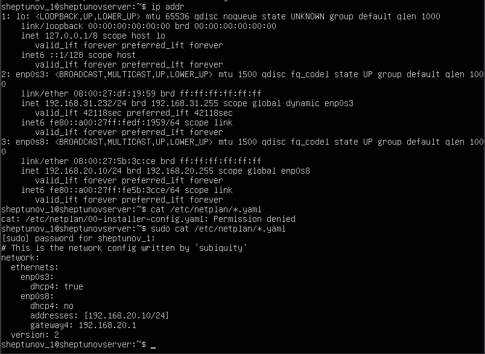
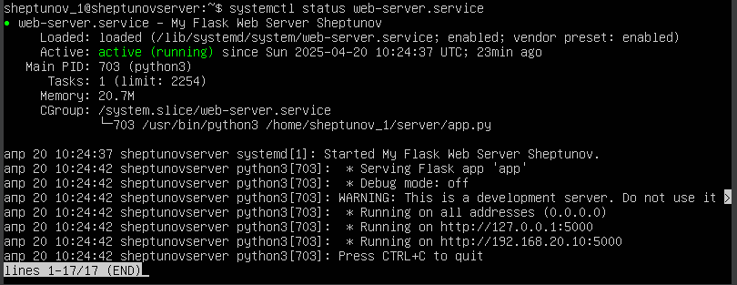
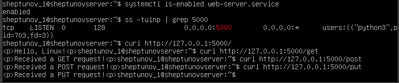
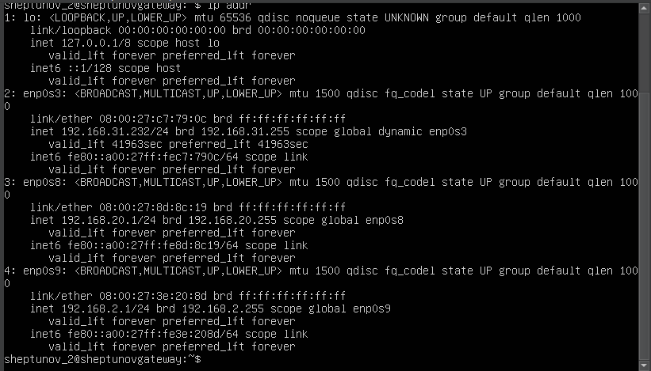
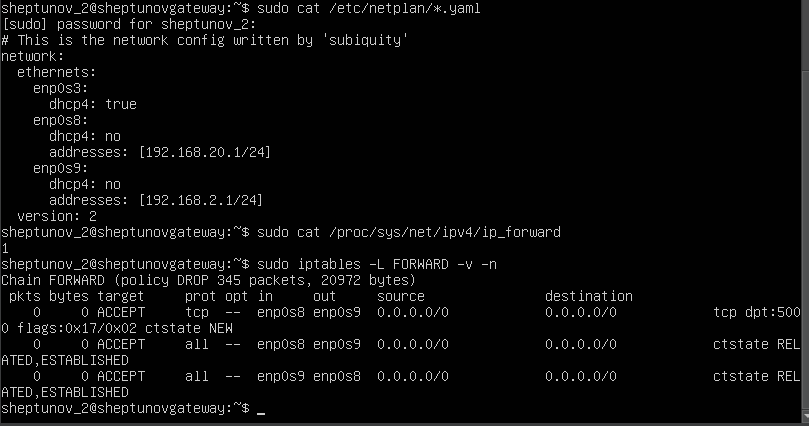
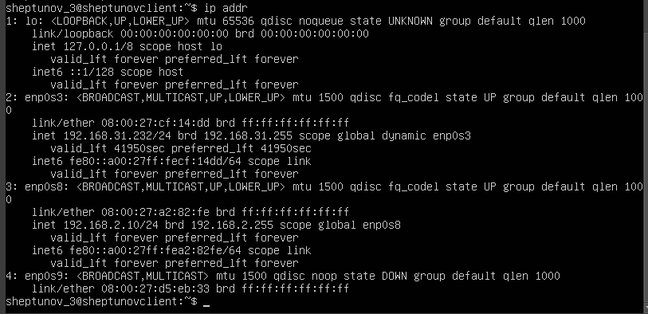
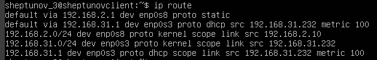
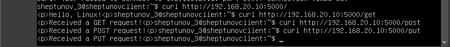
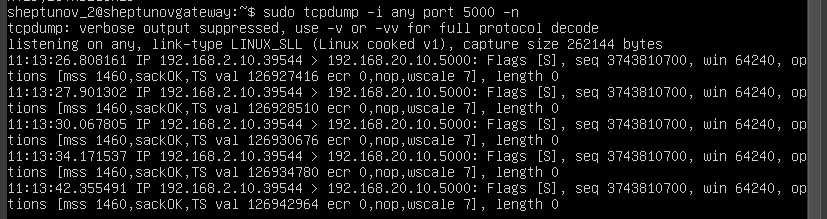
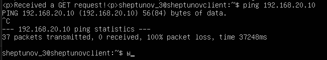

# Отчет по практической работе: Базовое администрирование Linux

**Цель работы:** Настройка трех виртуальных машин Linux (сервер, шлюз, клиент), конфигурация сети между ними, настройка маршрутизации с фильтрацией трафика и развертывание простого веб-сервера.

**Используемые инструменты:** VirtualBox, Ubuntu Server 20.04 LTS.

**Личные данные:**
*   Фамилия: sheptunov
*   День рождения: 20
*   Месяц рождения: 2

## 1. Подготовка виртуальных машин

Были созданы три виртуальные машины Ubuntu Server 20.04 в VirtualBox. Исходная машина была настроена, затем дважды клонирована.

## 2. Настройка Linux A (sheptunov_server)

### 2.1. Имя хоста и пользователь
*   Hostname: `sheptunov_server`
*   Пользователь: `sheptunov_1`

### 2.2. Настройка сети
Сетевые адаптеры в VirtualBox:
*   Адаптер 1: Сетевой мост (для доступа с хоста)
*   Адаптер 2: Внутренняя сеть `servernet`

Конфигурация Netplan (`/etc/netplan/00-installer-config.yaml`)

Проверка IP-адресов после применения Netplan:

### 2.3. Настройка веб-сервера (Flask)
Установлен Flask (pip install flask).
Создан файл app.py (см. папку application).
Создан и настроен сервис systemd /lib/systemd/system/web-server.service
Проверка статуса и автозагрузки сервиса:

Проверка локальной работы сервера:

## 3. Настройка Linux B (sheptunov_gateway)
### 3.1. Имя хоста и пользователь
Hostname: sheptunov_gateway
Пользователь: sheptunov_2

### 3.2. Настройка сети
Сетевые адаптеры в VirtualBox:
Адаптер 1: Сетевой мост
Адаптер 2: Внутренняя сеть servernet
Адаптер 3: Внутренняя сеть clientnet
Конфигурация Netplan (/etc/netplan/00-installer-config.yaml)

Проверка IP-адресов:
(Скриншот ip addr для машины B)

### 3.3. Настройка маршрутизации и файрвола
Включен IP Forwarding

Настроены правила iptables для пропуска трафика только на порт 5000 от C к A и связанных соединений. Политика по умолчанию для FORWARD - DROP.
(Скриншот команды sudo iptables -L FORWARD -v -n --line-numbers ПОСЛЕ настройки)

Правила сохранены с помощью iptables-persistent.

## 4. Настройка Linux C (sheptunov_client)
### 4.1. Имя хоста и пользователь
Hostname: sheptunov_client
Пользователь: sheptunov_3

### 4.2. Настройка сети
Сетевые адаптеры в VirtualBox:
Адаптер 1: Сетевой мост
Адаптер 2: Внутренняя сеть clientnet
Конфигурация Netplan (/etc/netplan/00-installer-config.yaml)

Проверка IP-адресов:
(Скриншот ip addr для машины C)

Проверка маршрута по умолчанию:
(Скриншот ip route для машины C)

## 5. Тестирование сквозного соединения
### 5.1. Запуск tcpdump на шлюзе (Linux B)
Запущена команда sudo tcpdump -i any port 5000 -n для отслеживания трафика.
### 5.2. Отправка запросов с клиента (Linux C) на сервер (Linux A)
Выполнены команды curl к http://192.168.20.10:5000 для эндпоинтов /get, /post, /put.
(Скриншот выполнения команд curl на машине C с успешными ответами)

### 5.3. Анализ трафика на шлюзе (Linux B)
Вывод tcpdump показал успешный обмен пакетами между C (192.168.2.10) и A (192.168.20.10) на порту 5000.
(Скриншот вывода tcpdump во время выполнения curl)

### 5.4. Проверка блокировки другого трафика
Попытка ping 192.168.20.10 с машины C была неуспешной (пакеты блокируются шлюзом B).
(Скриншот выполнения ping на машине C с потерей пакетов)

## 6. Проверка сохранения настроек после перезагрузки
Все три виртуальные машины были перезагружены (sudo reboot). После перезагрузки были выполнены следующие проверки:
IP Forwarding на Linux B активен (cat /proc/sys/net/ipv4/ip_forward показал 1).
Правила iptables на Linux B загружены (sudo iptables -L FORWARD -v -n показал настроенные правила).
Веб-сервер на Linux A запущен (systemctl status web-server.service показал active (running)).
Тестовый запрос curl http://192.168.20.10:5000/get с Linux C на Linux A прошел успешно.

## 7. Выводы
В ходе практической работы была успешно настроена сетевая инфраструктура из трех виртуальных машин Linux. Настроен статический IP-адрес для сервера (A) и клиента (C), а также два статических IP для шлюза (B). С помощью iptables на шлюзе настроена маршрутизация и фильтрация трафика, разрешающая только HTTP-запросы на порт 5000 от клиента к серверу. Веб-сервер на Flask был развернут на сервере и настроен для автозапуска с помощью systemd. Все настройки сохраняются после перезагрузки системы.